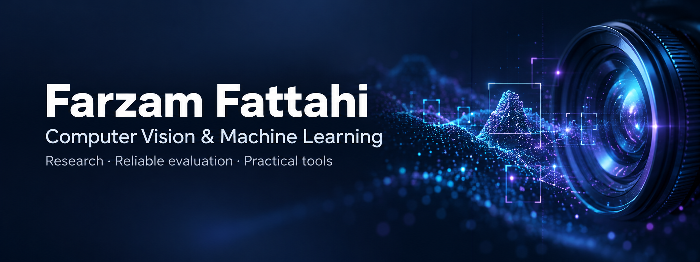

<h3><picture><source media="(prefers-reduced-motion: reduce)" srcset="assets/vision-eye-transparent-static.png"></picture>&nbsp; Hi, I'm Farzam</h3>

I build computer-vision tools and explore reliable ML evaluation, medical image classification, and efficient inference. Electrical engineering graduate from **IUST**, with a minor in computer engineering; Python and machine-learning instructor.

### Things I've built

| Project | Focus | Try it / read more |
| :--- | :--- | :--- |
| **[Object Detector](https://github.com/FarzamFattahi/object-detector)** | PPE detection, audited evaluation, and ONNX inference. | [Case study](https://github.com/FarzamFattahi/object-detector/blob/main/docs/PPE_CASE_STUDY.md) |
| **[MagnetLabel](https://github.com/FarzamFattahi/magnetlabel)** | Assisted box/mask annotation with reviewed YOLO/COCO exports. | [Windows app](https://github.com/FarzamFattahi/magnetlabel/releases/latest) |
| **[SplitLens](https://github.com/FarzamFattahi/splitlens)** | Image dataset audits for duplicates, leakage, and quality. | [Live app](https://farzamfattahi.github.io/splitlens/) |
| **[Prooflane](https://github.com/FarzamFattahi/prooflane)** | Screenshot comparison, region review, and HTML reports. | [Live app](https://farzamfattahi.github.io/prooflane/) |
| **[AirCursor](https://github.com/FarzamFattahi/aircursor)** | Webcam gestures for smooth Windows mouse control. | [Source & setup](https://github.com/FarzamFattahi/aircursor#quick-start) |

Also: **[Document Scanner](https://github.com/FarzamFattahi/document-scanner)** · perspective correction and OCR &nbsp; / &nbsp; **[Biscuit AR](https://github.com/FarzamFattahi/biscuit-ar)** · mobile web AR

### Research & toolkit

Currently working on **brain MRI classification**, **model validation**, and **geological fault analysis**. My classification and validation manuscripts are in preparation with Prof. Kourosh Parand.

**Vision & ML** &nbsp; Python · PyTorch · OpenCV · MediaPipe · scikit-learn · ONNX Runtime  
**Data & apps** &nbsp; NumPy · Pandas · React · TypeScript · Streamlit · MySQL · Git

### Let's connect

Research ideas, useful tools, or a good debugging story — my inbox is open.

[farzamfattahi79@gmail.com](mailto:farzamfattahi79@gmail.com)
